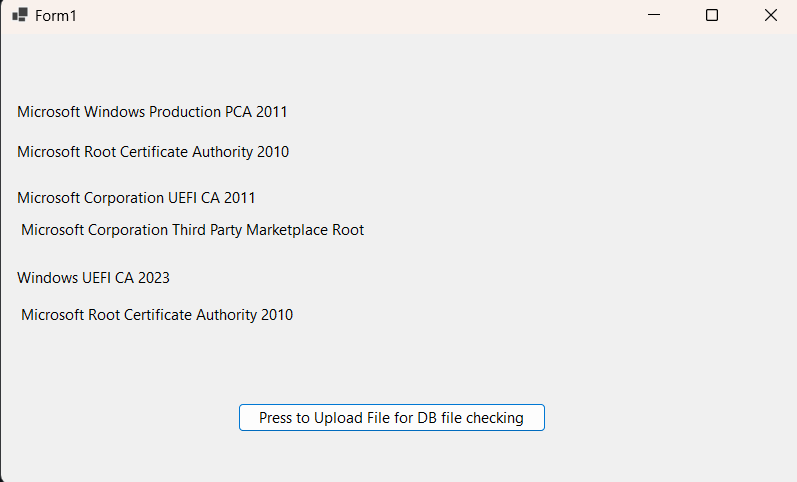

# DB SecureBoot Cert Detector

This application allows users to check the certifactes that they have on their machines in the DB that is BIOS UEFI CMOS NVRAM. Additionally the application works currently on the Windows Operating System and was written in C#, and PowerShell.

The application currently checks the following information:

    1. Microsoft Windows Production PCA 2011
    2. Windows UEFI CA 2023

It displays the the information in the Graphical User Interface (GUI).

# Update December 5th, 2024

I adjusted the graphical User Interface to not have an overlap between the certifactes,
additionally I included support for:

    3. Microsoft Corporation UEFI CA 2011 

GUI Appearance:
    

## Acknowledgements

 - Professors at Kean University
 - Professors at NJIT
 - Research Mentors at Kean University
 - StackOverflow Q&A Discussion
 - ChatGPT
 - ClaudeAI

## Authors

- [@FPyC639](https://github.com/FPyC639)

## Appendix

